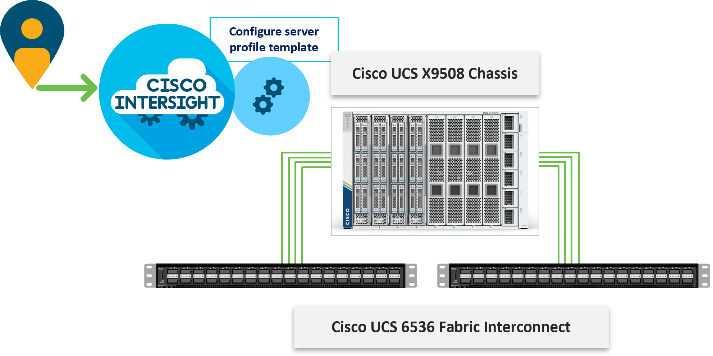

# Cisco Intersight Managed Mode setup using Ansible

 This repository contains Ansible playbooks to configure  Cisco UCS in Intersight Managed Mode (IMM). This repository can be used for setting up UCS in following Cisco Validated Design (CVD): https://www.cisco.com/c/en/us/td/docs/unified_computing/ucs/UCS_CVDs/flexpod_xseries_vmware_7u2.html (with minor changes) and has also been updated to support the end-to-end 100G FlexPod described at https://www.cisco.com/c/en/us/td/docs/unified_computing/ucs/UCS_CVDs/flexpod_ucs_xseries_e2e_ontap_design.html. For configuring the remaining components of the FlexPod, the following repository can be utilized: https://github.com/ucs-compute-solutions/FlexPod-UCSM-M6. In near future, a combined repository will be developed to configure all the components at the same time. This repository does not configure the UCS domain profile or policies associated with the USC domain profile. 

# Intersight Configuration

The playbooks in this repository perform the following functions:

1. Create various pools required to setup a Server Profile Template
2. Create various policies required to setup a Server Profile Template
3. Create iSCSI and/or FC Server Profile Templates

After successfully executing the playbooks, 1 or many server profiles can easily derived and attached to the compute node from Intersight dashboard.

**NOTE:** The addition of UCS to Intersight Account or configuration of Domain Profile to setup UCS is not part of this repository and will have to be performed manually before executing the playbooks. 

**NOTE:** The playbooks do not create an organization and assume an organization (default or otherwise) has already been setup under Intersight account. The organization name must be updated in group_vars/all.yml(org_name) for successful execuation of the playbooks.

# Execution Package Requirement

To execute the ansible playbooks for configuring IMM, a linux based system will need to be setup with ansible and following Ansible package needs to be installed:

https://galaxy.ansible.com/cisco/intersight?extIdCarryOver=true&sc_cid=701f2000001OH7YAAW

You might already have this collection installed. 

- To check whether it is installed, run: `ansible-galaxy collection list`
- To install it, use: `ansible-galaxy collection install cisco.intersight`

# Intersight Access Requirement

To execute the playbooks against your Intersight account, you need to complete following additional steps of creating an API key and saving the Secrets_File:

https://community.cisco.com/t5/data-center-and-cloud-documents/intersight-api-overview/ta-p/3651994

The API key and Secrets_Filename information is added to the group_vars/all.yml. The default Secrets_File value in all.yml assumes Secrets_File was copied to the same folder/directory where Ansible Playbooks were cloned (alongside inventory file).

# Setting up Variables

All the variables used in this framework are defined in the following locations:

1. Variable that require customer inputs are part of group_vars/all.yml
2. Variable that do not typically require customer input (e.g. descriptions etc.) are present under role_name/defauls/main.yml.

**NOTE:** All pools and policies created using these playbooks are tagged with user_defined_prefix and "ansible" to easily filter the configuration.
**NOTE:** In group_vars/all.yml, the Server CPU Type (Intel or AMD), VIC Type (4G or 5G), and VIC Slot ID (1 - 255, "MLOM", "L1", "L2") are selected. Various
policy and profile template names are then keyed with these indicators. If you have servers with more than one combination of these three items, these scripts are
designed where you set the variables in all.yml, then run the policy playbook and immediately run the profile template playbook. If you have another server combination,
reset the variables and run the policy and profile template playbooks again. The pools playbook only needs to be run once. Also, with FC-boot and iSCSI-boot
configurations the playbooks are designed where one or the other or both can be run. Note that to add NVMe-TCP, you only have to add the NVMe-TCP VLANs to the allowed VLANs list for iSCSI A and B vNICs.

# Post Configuration Tasks

Execution of the playbooks in these repositories set up Server Profile Templates. After successfully executing the playbooks, one or more server profiles can easily derived and attached to the compute node from Intersight dashboard. KVM mounted DVD option is available to install OS to these newly derived servers.

# Playbook Execution Commands - Summary

1. Setup various pools: `ansible-playbook ./create_pools.yml -i inventory`
2. Setup various policies: `ansible-playbook ./create_server_policies.yml -i inventory`
3. Setup Server Profile Template(s): `ansible-playbook ./create_server_profile_template.yml -i inventory`

